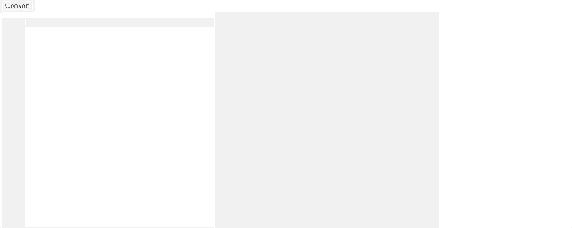

# PCML
Pythonic mark up language that converts to HTML. Inspired by Clojure and hiccup.

**Note: this is still in development**


Hiccup inspired mark up language. Wite your HTML like so:
```
:div
:main.vmainClass1.vmainClass2
  :div#main-container
    :div#keyboard-shortcut.class2
    :div
    :div
  :div.form-container
    :form method=post
  :v-icon
    :v-con
```

### Installation
Currently using jupyterlab to do development and experiments.

```
$ virtualenv venv
$ source venv/bin/active
$ pip install -r requirements.txt
$ jupyter-lab
```

### Docs
- Tags begin with `:` and that is how they are identified.
- Nested items are defined by tabs; so, tabs are important. Currently set to 4.
- `id` of an element begins with a `#`.
- `class` is defined by a `.` at the start of each class.

